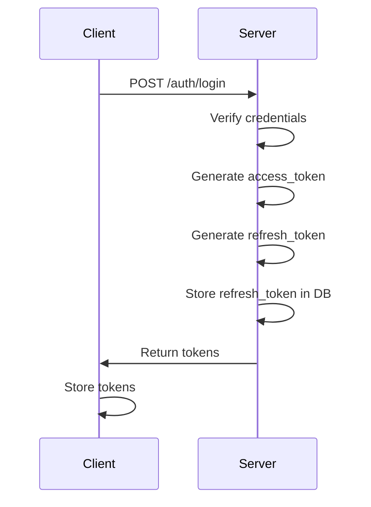
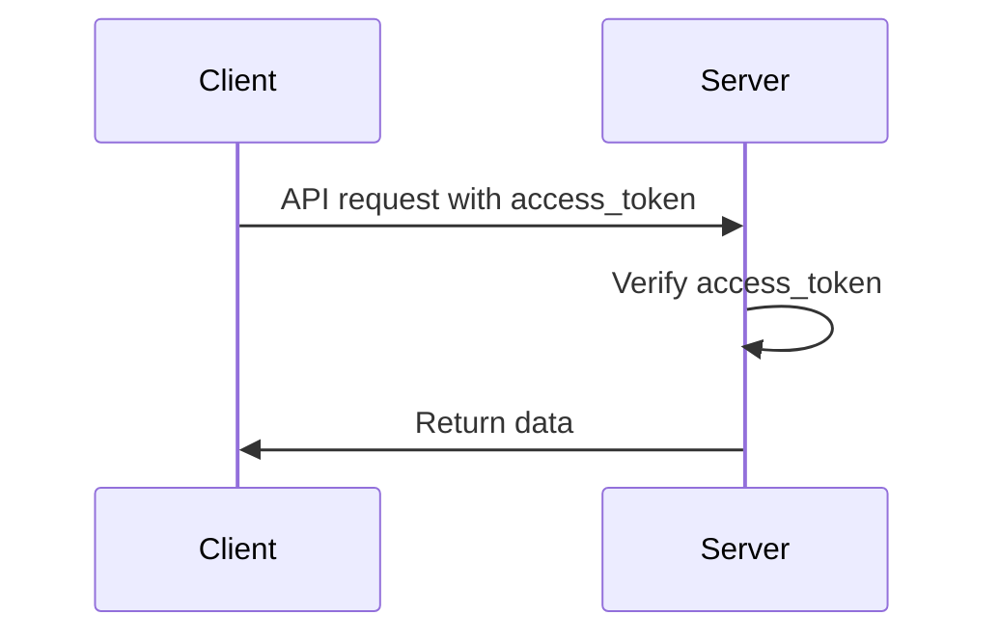
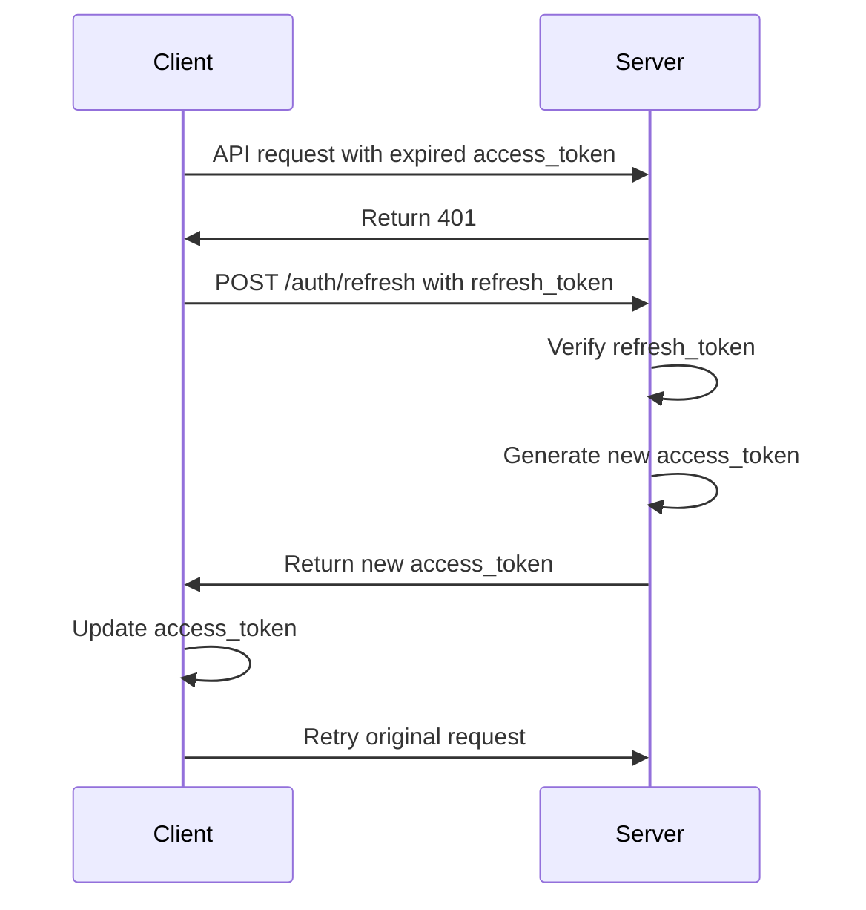
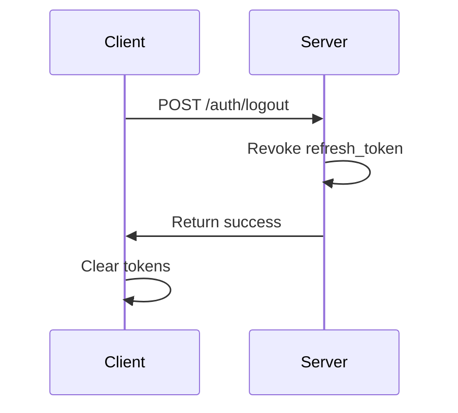

# Authentication System

## Overview
The authentication system uses JWT (JSON Web Token) combined with Refresh Token to provide secure and efficient user authentication. This approach is particularly suitable for modern web applications with FastAPI backend and JavaScript frontend frameworks.

## Components

### 1. JWT Token
- **Purpose**: Short-lived token for API access
- **Lifetime**: 15 minutes
- **Structure**:
  ```json
  {
    "sub": "user_id",
    "exp": "expiration_timestamp",
    "type": "access"
  }
  ```
- **Storage**: Client-side (localStorage/cookie)
- **Usage**: Sent in Authorization header for API requests

### 2. Refresh Token
- **Purpose**: Long-lived token for obtaining new access tokens
- **Lifetime**: 7 days
- **Structure**:
  ```json
  {
    "sub": "user_id",
    "exp": "expiration_timestamp",
    "type": "refresh"
  }
  ```
- **Storage**: 
  - Client-side: localStorage/cookie
  - Server-side: Database (for revocation)
- **Usage**: Used to obtain new access tokens when current one expires

## Authentication Flow

### 1. Login Process


### 2. API Access


### 3. Token Refresh


### 4. Logout Process


## Security Measures

### 1. Token Security
- Access tokens are short-lived (15 minutes)
- Refresh tokens are long-lived (7 days) but can be revoked
- Tokens are signed with a secure secret key
- Tokens are transmitted over HTTPS only

### 2. Storage Security
- Access tokens stored in memory when possible
- Refresh tokens stored in HttpOnly cookies
- Server-side storage of refresh tokens for revocation

### 3. Additional Security
- CORS configuration
- Rate limiting on authentication endpoints
- Input validation
- Error handling
- Security headers

## Implementation Details

### 1. Backend (FastAPI)

#### Authentication Flow (src/api/auth.py)
```python
@router.post("/login")
async def login(request: LoginRequest, db: Session) -> Any:
    """
    Login flow:
    1. Authenticate user credentials
    2. Create access token using create_access_token()
    3. Create and store refresh token using create_and_store_refresh_token()
    4. Return both tokens to client
    """

@router.post("/refresh-token")
async def refresh_token(refresh_data: TokenRefresh, db: Session) -> Any:
    """
    Refresh token flow:
    1. Verify refresh token using verify_refresh_token()
    2. Create new access token using create_access_token()
    3. Return new access token to client
    """

@router.post("/logout")
async def logout(request: LogoutRequest, db: Session) -> Any:
    """
    Logout flow:
    1. Verify token using verify_token()
    2. Revoke refresh token using revoke_refresh_token()
    3. Return success response
    """
```

#### Security Functions (src/core/security.py)
```python
def create_access_token(data: dict, expires_delta: Optional[timedelta] = None) -> str:
    """
    Create a new access token with optional custom expiration time
    """

def create_and_store_refresh_token(db: Session, user_id: int) -> str:
    """
    Create a new refresh token and store it in the database
    """

def revoke_refresh_token(db: Session, refresh_token: str):
    """
    Revoke a refresh token by marking it as revoked in the database
    """

def verify_token(token: str) -> dict:
    """
    Verify a token and return its payload
    """

def verify_refresh_token(db: Session, token: str) -> RefreshToken:
    """
    Verify refresh token and return the token object
    """
```

### 2. Frontend (JavaScript)
Location: `src/frontend/services/auth.service.js`

```javascript
// Token Management
class AuthService {
  async login(email, password) {
    const response = await axios.post('/auth/login', {
      email: email,
      password: password
    });
    
    if (response.data.data.access_token) {
      localStorage.setItem('access_token', response.data.data.access_token);
      localStorage.setItem('refresh_token', response.data.data.refresh_token);
    }
  }
  
  async refreshToken() {
    const refresh_token = localStorage.getItem('refresh_token');
    const response = await axios.post('/auth/refresh-token', {
      refresh_token
    });
    
    if (response.data.data.access_token) {
      localStorage.setItem('access_token', response.data.data.access_token);
      if (response.data.data.refresh_token) {
        localStorage.setItem('refresh_token', response.data.data.refresh_token);
      }
    }
  }

  async logout() {
    const refresh_token = localStorage.getItem('refresh_token');
    await axios.post('/auth/logout', {
      refresh_token
    });
    localStorage.removeItem('access_token');
    localStorage.removeItem('refresh_token');
  }
}

// Axios Interceptor
axios.interceptors.response.use(
  (response) => response,
  async (error) => {
    if (error.response.status === 401) {
      try {
        await authService.refreshToken();
        return axios(error.config);
      } catch (error) {
        await authService.logout();
        window.location.href = '/login';
      }
    }
    return Promise.reject(error);
  }
);
```

## Best Practices

### 1. Token Management
- Keep access tokens short-lived (15 minutes)
- Implement proper token refresh mechanism
- Handle token expiration gracefully
- Implement token revocation for logout
- Store refresh tokens in database for revocation
- Use secure token storage (HttpOnly cookies)

### 2. Security
- Use HTTPS for all communications
- Implement proper CORS policies
- Use secure cookie settings
- Implement rate limiting
- Validate all inputs
- Handle errors properly
- Store refresh tokens in database
- Implement token revocation
- Use proper token type validation

### 3. Performance
- Minimize token size
- Implement proper caching
- Handle concurrent requests properly
- Implement proper error handling
- Use efficient database queries for token validation

### 4. User Experience
- Implement silent token refresh
- Handle session expiration gracefully
- Provide clear error messages
- Implement proper loading states
- Automatic token refresh before expiration

## Error Handling

### 1. Common Errors
- Invalid credentials
- Token expiration
- Invalid token
- Invalid token type
- Rate limit exceeded
- Network errors
- Revoked refresh token
- Inactive user

### 2. Error Responses
```json
{
  "status": "error",
  "message": "Invalid token",
  "errors": {
    "type": "unauthorized"
  }
}
```

## Testing

### 1. Unit Tests
- Token generation
- Token verification
- Token refresh
- Error handling
- Token revocation
- User authentication

### 2. Integration Tests
- Login flow
- API access
- Token refresh
- Logout flow
- Token revocation
- Error scenarios

### 3. Security Tests
- Token validation
- CORS configuration
- Rate limiting
- Input validation
- Token revocation
- Refresh token validation

## Monitoring and Logging

### 1. What to Monitor
- Authentication attempts
- Token refreshes
- Failed logins
- Token revocations
- Invalid token attempts
- Rate limit hits

### 2. What to Log
- Authentication events
- Token operations
- Security events
- Error events
- Token revocation events
- Invalid token attempts

## Future Improvements

### 1. Planned Features
- Multi-factor authentication
- Social login integration
- Remember me functionality
- Session management
- Token rotation
- Enhanced security analytics

### 2. Security Enhancements
- Token rotation
- Enhanced rate limiting
- Advanced monitoring
- Security analytics
- Token blacklisting
- Enhanced token validation

## Postman Setup

### 1. Collection Structure
```
Base-fastapi
├── users
│   ├── create-user
│   ├── me
│   └── ...
├── auth
│   ├── register
│   ├── refresh-token
│   ├── login
│   └── logout
└── ping
```

### 2. Environment Variables
```json
{
  "url": "http://localhost:8000",
  "access_token": "",
  "refresh_token": ""
}
```

### 3. Collection Pre-request Script
```javascript
// Check if current request is not login
if (!pm.request.url.toString().includes('/auth/login')) {
    // Check if refresh_token exists
    if (pm.environment.get('refresh_token')) {
        // Get current access_token
        const currentAccessToken = pm.environment.get('access_token');
        
        // Decode JWT token to check expiration time
        try {
            const tokenParts = currentAccessToken.split('.');
            const payload = JSON.parse(atob(tokenParts[1]));
            const expirationTime = payload.exp * 1000; // Convert to milliseconds
            const currentTime = new Date().getTime();
            
            // Only refresh token if it expires in less than 5 minutes
            if (expirationTime - currentTime < 5 * 60 * 1000) {
                // Call refresh API
                pm.sendRequest({
                    url: pm.environment.get('url') + '/auth/refresh-token',
                    method: 'POST',
                    header: {
                        'Content-Type': 'application/json'
                    },
                    body: {
                        mode: 'raw',
                        raw: JSON.stringify({
                            refresh_token: pm.environment.get('refresh_token')
                        })
                    }
                }, function (err, res) {
                    if (err) {
                        console.error(err);
                    } else {
                        // Save new access_token
                        var jsonData = res.json();
                        pm.environment.set('access_token', jsonData.data.access_token);
                        // Update refresh_token if provided
                        if (jsonData.refresh_token) {
                            pm.environment.set('refresh_token', jsonData.data.refresh_token);
                        }
                    }
                });
            }
        } catch (error) {
            console.error('Error decoding token:', error);
        }
    }
}
```

### 4. Request Scripts

#### Login - Post-response Script
```javascript
// Check if response is successful
if (pm.response && pm.response.code === 200) {
    // Get tokens from response
    var jsonData = pm.response.json();
    // Save tokens to environment variables
    pm.environment.set("access_token", jsonData.data.access_token);
    pm.environment.set("refresh_token", jsonData.data.refresh_token);
    
    // Log for verification
    console.log("Tokens have been saved:", {
        access_token: jsonData.data.access_token,
        refresh_token: jsonData.data.refresh_token
    });
}
```

#### Logout - Post-response Script
```javascript
// Check if response is successful
if (pm.response && pm.response.code === 200) {
    // Remove tokens from environment variables
    pm.environment.unset("access_token");
    pm.environment.unset("refresh_token");
    
    // Log for verification
    console.log("Tokens have been removed");
}
```

#### Refresh Token - Post-response Script
```javascript
// Check if response is successful
if (pm.response.code === 200) {
    // Get access token from response
    var jsonData = pm.response.json();
    // Save new access token to environment
    pm.environment.set("access_token", jsonData.data.access_token);
    
    // Log for verification
    console.log("New access token has been saved:", jsonData.data.access_token);
}
```

### 5. Usage Instructions
1. Import the collection into Postman
2. Create a new environment and set the variables
3. Run the login request to get initial tokens
4. The pre-request script will automatically handle token refresh
5. Use the collection for API testing

### 6. Best Practices
- Store sensitive data in environment variables
- Use pre-request scripts for authentication
- Implement automatic token refresh
- Use environment-specific configurations
- Handle errors properly in scripts
- Use proper logging for debugging