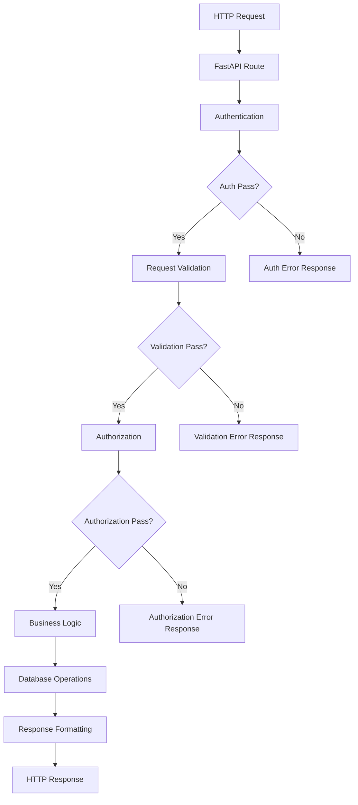

# Core Concepts

## Project Structure
```
src/
├── api/            # API endpoints and route handlers
├── core/           # Core functionality and configurations
├── db/             # Database models and migrations
├── docs/           # Project documentation
├── schemas/        # Pydantic models for request/response
└── services/       # Business logic and service layer
```

## Core Principles

### 1. Clean Architecture
- **Separation of Concerns**: Each layer has a specific responsibility
  - API Layer: Handle HTTP requests/responses
  - Service Layer: Implement business logic
  - Data Layer: Handle database operations
  - Schema Layer: Define data structures

- **Dependency Injection**: Use FastAPI's dependency injection system
  ```python
  @router.post("/login")
  async def login(
      request: LoginRequest,
      db: Session = Depends(get_db)
  ) -> Any:
  ```

### 2. Response Standardization
- Consistent response format across all endpoints
- Use success_response and error_response helpers

```python
# Success Response
return success_response(
    data=data,
    message="Operation successful message"
)

# Error Response
return error_response(
    errors=errors,
    message="Error message"
)
```

#### Common Response Structure

1. Success Response Format:
```json
{
    "status": "success",
    "message": "Operation successful message",
    "data": {
        // Response data object
    }
}
```

2. Error Response Format:
```json
{
    "status": "error",
    "message": "Error message",
    "errors": {
        // Error details object
    }
}
```

### 3. Request Flow Lifecycle


**Flow Description**:
1. **Request Entry**
   - HTTP request received
   - Route matching
   - Dependency injection

2. **Authentication Layer**
   - Token validation
   - User identification
   - Session management

3. **Validation Layer**
   - Schema validation
   - Type checking
   - Custom validation
   - Early error detection

4. **Authorization Layer**
   - Permission checking
   - Role validation
   - Resource access control

5. **Business Logic Layer**
   - Service layer processing
   - Business rules application
   - Data transformation

6. **Data Layer**
   - Database operations
   - Transaction management
   - Data persistence

7. **Response Layer**
   - Response formatting
   - Error handling
   - Status code mapping

**Error Handling**:
- Each layer has specific error types
- Errors are caught and formatted consistently
- Appropriate HTTP status codes
- Detailed error messages
- Error logging and monitoring

### 4. Error Handling
- Custom exceptions for different error types
- Centralized error handling
- Consistent error response format

```python
class AppException(Exception):
    def __init__(
        self,
        message: str,
        error_type: str,
        status_code: int = 400
    ):
        self.message = message
        self.error_type = error_type
        self.status_code = status_code
        super().__init__(message)

class ValidationException(AppException):
    def __init__(self, message: str):
        super().__init__(
            message=message,
            error_type="validation_error",
            status_code=400
        )

class UnauthorizedException(AppException):
    def __init__(self, message: str):
        super().__init__(
            message=message,
            error_type="unauthorized",
            status_code=401
        )
```

### 5. Security
- JWT-based authentication
- Refresh token mechanism
- Secure password hashing
- Token revocation support

### 6. Database Design
- SQLAlchemy ORM
- Migration support with Alembic
- Relationship management
- Soft delete support

## Feature Implementation Guidelines

### 1. API Endpoints
- Use FastAPI router for endpoint grouping
- Implement proper request/response models
- Add comprehensive docstrings
```python
@router.post("/endpoint")
async def endpoint(
    request: RequestModel,
    db: Session = Depends(get_db)
) -> Any:
    """
    Endpoint description
    
    Args:
        request: Request model
        db: Database session
    
    Returns:
        Response model
    """
```

### 2. Service Layer
- Implement business logic in service layer
- Use dependency injection for database access
- Handle database transactions
```python
async def create_user(db: Session, obj_in: UserCreate) -> User:
    """
    Create new user
    
    Args:
        db: Database session
        obj_in: User creation model
    
    Returns:
        Created user object
    """
```

### 3. Data Models
- Use Pydantic for request/response models
- Implement proper validation
- Use proper type hints
```python
class UserCreate(BaseModel):
    email: EmailStr
    password: str
    full_name: str
    
    model_config = ConfigDict(from_attributes=True)
```

### 4. Database Models
- Define clear relationships
- Implement proper indexes
- Use appropriate column types
```python
class User(Base):
    __tablename__ = "users"
    
    id = Column(Integer, primary_key=True, index=True)
    email = Column(String, unique=True, index=True)
    hashed_password = Column(String)
    is_active = Column(Boolean, default=True)
```

## Best Practices

### 1. Code Organization
- Follow project structure
- Use proper naming conventions
- Implement proper documentation
- Use type hints

### 2. Security
- Implement proper authentication
- Use secure password hashing
- Implement rate limiting
- Use proper CORS settings

### 3. Performance
- Use proper database indexes
- Implement caching where needed
- Optimize database queries
- Use proper connection pooling

### 4. Maintainability
- Write clean, readable code
- Add proper comments
- Follow PEP 8 guidelines
- Use proper logging

## Feature Implementation Flow

### 1. Planning Phase
1. **Define Requirements**
   - Understand business requirements
   - Define API endpoints
   - Document expected behavior
   - Plan error scenarios

2. **Design Data Models**
   - Design database schema
   - Define Pydantic models
   - Plan relationships
   - Consider indexes

### 2. Implementation Phase
1. **Create Database Models** (`src/db/models/`)
   ```python
   class NewFeature(Base):
       __tablename__ = "new_features"
       
       id = Column(Integer, primary_key=True, index=True)
       # Define columns
   ```

2. **Create Schemas** (`src/schemas/`)
   ```python
   class NewFeatureCreate(BaseModel):
       # Define input fields
       
   class NewFeatureResponse(BaseModel):
       # Define response fields
   ```

   #### Request Validation
   Request validation is implemented through Pydantic models, ensuring data integrity before processing business logic. Validation is performed at two levels:

   1. **Schema Level**: Basic validation
      - Data type checking
      - Length constraints (min/max length)
      - Format validation (email, pattern)
      - Required/Optional fields

   2. **Custom Level**: Complex validation
      - Uniqueness checks
      - Multi-field validation
      - Business rules validation
      - Database interaction

   ```python
   from typing import Optional
   from pydantic import BaseModel, EmailStr, Field, field_validator

   # Base schema for common fields
   class FeatureBase(BaseModel):
       name: str = Field(..., min_length=3, max_length=50)
       description: Optional[str] = None

   # Schema for creation
   class FeatureCreate(FeatureBase):
       code: str = Field(..., min_length=5)
       
       # Custom validation
       @field_validator('code')
       def validate_code_unique(cls, v):
           db = SessionLocal()
           try:
               if db.query(Feature).filter(Feature.code == v).first():
                   raise DuplicateEntryException(field="code", value=v)
           finally:
               db.close()
           return v

   # Schema for update
   class FeatureUpdate(BaseModel):
       name: Optional[str] = Field(None, min_length=3, max_length=50)
       description: Optional[str] = None
       code: Optional[str] = Field(None, min_length=5)
   ```

   **Best Practices**:
   - Use base schema for common fields
   - Separate schemas for create/update/response
   - Validate as early as possible in request lifecycle
   - Handle validation errors consistently
   - Optimize database queries in custom validators

3. **Implement Service Layer** (`src/services/`)
   ```python
   async def create_new_feature(
       db: Session,
       obj_in: NewFeatureCreate
   ) -> NewFeature:
       # Implement business logic
   ```

4. **Create API Endpoints** (`src/api/`)
   ```python
   @router.post("/new-feature")
   async def create_new_feature(
       request: NewFeatureCreate,
       db: Session = Depends(get_db)
   ) -> Any:
       # Implement endpoint logic
   ```

5. **Write Tests** (`tests/`)
   ```python
   # Unit tests (tests/unit/)
   def test_create_feature_success():
       # Arrange
       feature_data = {
           "name": "Test Feature",
           "code": "TEST001"
       }
       
       # Act
       response = client.post("/api/features", json=feature_data)
       
       # Assert
       assert response.status_code == 200
       assert response.json()["status"] == "success"
       assert response.json()["data"]["name"] == feature_data["name"]

   # Integration tests (tests/integration/)
   def test_feature_workflow():
       # Test complete feature workflow
       # Create -> Update -> Delete
       pass
   ```

### 3. Documentation Phase
1. **API Documentation**
   - Update OpenAPI docs with proper descriptions
   - Add request/response examples
   - Document all possible error responses
   - Add authentication requirements
   ```python
   @router.post("/users", response_model=UserResponse)
   async def create_user(
       request: UserCreate,
       db: Session = Depends(get_db)
   ) -> Any:
       """
       Create a new user
       
       Args:
           request: User creation data
           db: Database session
           
       Returns:
           UserResponse: Created user data
           
       Raises:
           ValidationException: If input data is invalid
           DuplicateEntryException: If email already exists
       """
   ```

2. **Code Documentation**
   - Add docstrings to all functions
   - Document complex business logic
   - Add type hints
   - Update README if needed

3. **Test Documentation**
   - Document test scenarios
   - Add test data setup instructions
   - Document test coverage requirements
   - Add integration test flows

### 4. Review Checklist
- [ ] Code Structure
  - [ ] Follows project structure
  - [ ] Proper file organization
  - [ ] Clear naming conventions
  - [ ] Type hints implemented

- [ ] API Implementation
  - [ ] Proper request validation
  - [ ] Standard response format
  - [ ] Error handling
  - [ ] Authentication/Authorization

- [ ] Database
  - [ ] Proper model relationships
  - [ ] Indexes defined
  - [ ] Migration scripts
  - [ ] Query optimization

- [ ] Testing
  - [ ] Unit tests written
  - [ ] Integration tests written
  - [ ] Test coverage > 80%
  - [ ] Edge cases covered

- [ ] Documentation
  - [ ] API docs complete
  - [ ] Code documented
  - [ ] Test docs added
  - [ ] README updated

- [ ] Security
  - [ ] Input validation
  - [ ] Authentication checks
  - [ ] Authorization rules
  - [ ] Error messages sanitized

- [ ] Performance
  - [ ] Database queries optimized
  - [ ] Proper indexing
  - [ ] Connection pooling
  - [ ] Response time acceptable